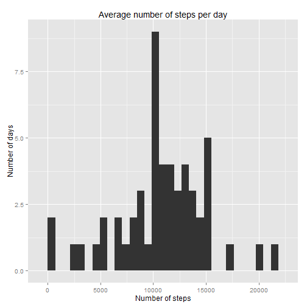
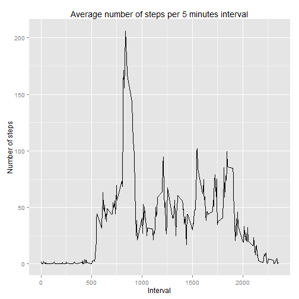
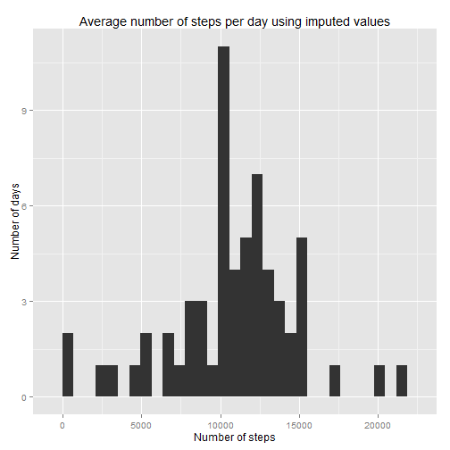
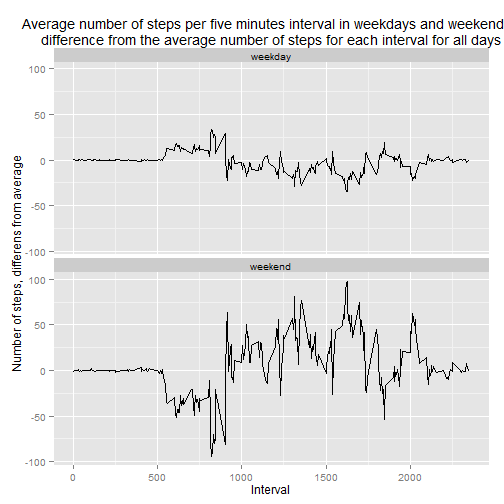

```r
library(dplyr)
```

```
## 
## Attaching package: 'dplyr'
## 
## The following objects are masked from 'package:stats':
## 
##     filter, lag
## 
## The following objects are masked from 'package:base':
## 
##     intersect, setdiff, setequal, union
```

```r
library(ggplot2)
library(reshape2)
library(knitr)
# Avoid scientific notation
options(scipen=999)

# Load data
unzip("activity.zip", files = NULL, list = FALSE, 
              overwrite = TRUE,junkpaths = FALSE, exdir = "./data", 
              unzip = "internal", setTimes = FALSE)

data <- read.csv("data/activity.csv")

# Calculate day of week and weekday or weekend
days <- as.POSIXlt(as.character(data$date))
data$day <- days$wday
data$daygrp <- "weekday"
data[data$day==0 | data$day==6, "daygrp"] <- "weekend"
data$daygrp <- as.factor(data$daygrp)

# Impute missing data. Imputed values are set to the mean of the same
# interval in the same day of the week in the whole period, if  f.x interval
# 5 of the first Monday is missing the value are set to the mean of all interval 5 for all Mondays.
# I have choose to not make a different data set for the imputed values but instead just create a 
# new variable in the original data set. The reason to do this is that it makes it easier to 
# compare the imputed value with the original values to see if they are reasonable.

data$impstep <- data$step
for(i in  1:length(data$step)) {
 if (is.na(data$step[i])) {
   data$impstep[i]=mean(data[data$interval==data$interval[i] & 
                               data$day==data$day[i], "steps"], na.rm=T)
 }
}


# Calculate steps per day, excluding NA:s
dateExclNA <- data[complete.cases(data), ]
stepDay <- dateExclNA %>%
  select(date, steps) %>%
  group_by(date) %>%
  summarise(stepsPerDay = sum(steps, na.rm = TRUE))

# Calculate mean steps per day and median steps per day with NA:s excluded
mean(stepDay$stepsPerDay, na.rm=T)
median(stepDay$stepsPerDay, na.rm=T)

# Calculating steps per intervall
stepInterval <- data %>%
  select(interval, steps) %>%
  group_by(interval) %>%
  summarise(stepsPerInt = mean(steps, na.rm=T))

# Find then interval with most steps
maxSteps <- stepInterval[stepInterval$stepsPerInt==max(stepInterval$stepsPerInt), ]

# Calculating steps per day using imputed values for NA:s
stepDayimp <- data %>%
  select(date, impstep) %>%
  group_by(date) %>%
  summarise(stepsPerDay = sum(impstep))

# Calculate average number of steps per interval for weekdays and weekends
stepDaygrp <- data %>%
  select(daygrp, interval, impstep) %>%
  group_by(daygrp,interval) %>%
  summarise(stepsPerInt = mean(impstep, na.rm=T))
stepDaygrp$avgStep <- NA
mean(data[data$interval==5, "impstep"])
for(i in 1:length(stepDaygrp$interval)) {
  stepDaygrp$avgStep[i] <- mean(data[data$interval==stepDaygrp$interval[i], "impstep"])
}
stepDaygrp$diffSteps <- stepDaygrp$stepsPerInt - stepDaygrp$avgStep


totSteps <- data %>%
  select(daygrp, date, impstep) %>%
  group_by(daygrp, date) %>%
  summarise(stepsPerDay = sum(impstep, na.rm=T)) %>%
  group_by(daygrp) %>%
  summarise(stepsPerDaygrp = mean(stepsPerDay, na.rm=T))

mean(stepDay$stepsPerDay, na.rm=T)
median(stepDay$stepsPerDay, na.rm=T)
maxSteps[1,1]

totPeriods <- length(data$steps)
totDays <-length(levels(data$date))
startDate <- min(as.character(data$date))
lastDate <- max(as.character(data$date))
missingValues <- sum(is.na(data$steps))
meanStepsPeriod <- mean(data$steps, na.rm = T)
meanImpStepPeriod <- mean(data$impstep)
medianImpStepPeriod <- median(data$impstep)
meanStepsDay <- mean(stepDay$stepsPerDay)
meanImpStepsDay <- mean(stepDayimp$stepsPerDay)
medianStepsDay <- median(stepDay$stepsPerDay)
medianImpStepsDay <- median(stepDayimp$stepsPerDay)
totStepsDayWeekday <- totSteps[totSteps$daygrp=="weekday",2]
totStepsDayWeekend <- totSteps[totSteps$daygrp=="weekend",2]
```


## The mean total number of steps taken per day


The mean steps per day with missing values excluded is 10766.1887 and the median is 10765.

  


```r
ggplot(stepDay, aes(x=stepsPerDay)) + 
  geom_histogram() +
  ggtitle("Average number of steps per day") +
  xlab("Number of steps") +
  ylab("Number of days")
```

```
## stat_bin: binwidth defaulted to range/30. Use 'binwidth = x' to adjust this.
```

 

## The average daily activity pattern

``


```r
ggplot(stepInterval, aes(x=interval, y=stepsPerInt)) + 
  geom_line() +
  ggtitle("Average number of steps per 5 minutes interval") +
  xlab("Interval") +
  ylab("Number of steps")
```

 


The interval that produced the maximum number of steps across all days was 835 to 840 minutes, that on average produced 206.1698 steps.


## Imputing missing values


There are a total of 17568 five minutes intervals in the data set,  covering the number of steps over a period of 61 days (from 2012-10-01 to 2012-11-30). Of these values a total of 2304 contains missing values (coded as NAs). 

The chosen strategy to handle NAs is to impute values by setting the missing values to the average of the same five minutes interval for the same day of the week in the whole dataset, f.x. if the  first interval (0-5 minutes) for the first Monday contains a NA, then it is replaced with the average for the same interval for all Mondays in the data set.

Compared to the original data, the imputed values rising the mean number of steps per interval slightly (from 37.3826 to 37.5736), but it doesn´t effect the median that is 0. 

The total number of steps per day on average is 10766.1887. In the data with imputed values the average is 10821.2096. The median value is 10765 and the corresponding median for the imputed values  is 11015


```r
ggplot(stepDayimp, aes(x=stepsPerDay)) + 
  geom_histogram() +
  ggtitle("Average number of steps per day using imputed values") +
  xlab("Number of steps") +
  ylab("Number of days")
```

```
## stat_bin: binwidth defaulted to range/30. Use 'binwidth = x' to adjust this.
```

 


## Differences in activity patterns between weekdays and weekends


The number of steps per interval differs depending on if the day is a weekdays or a day in a weekend. As expected the activitys early in the morning are lower in the weekends but after that the number of steps per interval is mostly higher in the weekends. The average number of steps per day in the weekdays is 10257.5254 that can be compared with the average number of steps per day in the weekends, that is 12406.5714.


```r
ggplot(stepDaygrp, aes(x=interval, y=diffSteps)) + 
  geom_line() +
  facet_wrap(~daygrp, ncol=1) +
  ggtitle("Average number of steps per five minutes interval in weekdays and weekends, \ndifference from the average number of steps for each interval for all days") +
  xlab("Interval") +
  ylab("Number of steps, differens from average")
```

 

